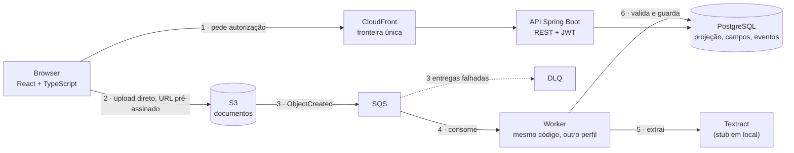
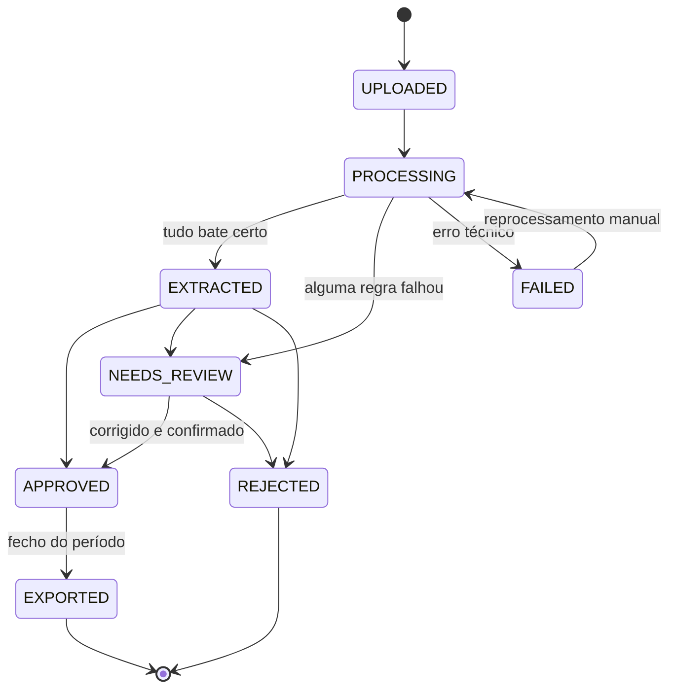

# DocGrid

[](https://github.com/goncaloe/docgrid/actions/workflows/ci.yml)
[](https://github.com/goncaloe/docgrid/actions/workflows/image.yml)
[](LICENSE)

**Uma PME recebe 200 faturas por mês e alguém as copia à mão para a contabilidade. O
DocGrid lê-as, valida-as contra as regras fiscais portuguesas e diz onde é preciso olhar.**


## A demonstração

**Não há URL pública** — não há conta AWS, por decisão
([ADR 0019](docs/adr/0019-infraestrutura-como-desenho.md)). A demonstração levanta-se em
local com dois comandos e dados a sério:

```bash
npm run seed    # levanta a infraestrutura, semeia 61 documentos e termina (≈ 30 s)
npm run up      # a aplicação, já com dados; deixa a correr
```

**Por esta ordem.** O seed põe os ficheiros no S3 e deixa o *worker do seu próprio processo*
processá-los pela fila. Se já houver uma aplicação a correr, o worker dela apanha parte das
mensagens e processa-as com o stub — metade dos documentos ficavam iguais. O seed deteta-o e
pára com a explicação, mas é mais simples não o provocar.

Depois, `cd frontend && npm install && npm run dev` e entra em http://localhost:5173:

| Entra como | Email | O que vê |
| --- | --- | --- |
| Assistente financeiro | `finance@docgrid.local` | A fila de revisão inteira — é o ecrã a ver primeiro |
| Gestor | `gestor@docgrid.local` | O mesmo, mais as despesas acima do limite de aprovação |
| Funcionário | `joao@docgrid.local` | Só as despesas que ele próprio submeteu |
| Administrador | `admin@docgrid.local` | Tudo, incluindo a dead-letter queue |

A password é `docgrid-demo` nos quatro. Vale só para o LocalStack desta máquina: não é o
segredo de nada que exista fora dela.

## A arquitetura



O ficheiro nunca passa pela API: o browser recebe uma autorização e escreve direto no S3
([ADR 0005](docs/adr/0005-upload-com-url-pre-assinado.md)). Quem processa é o worker, do
outro lado de uma fila.

## O problema

Uma PME recebe entre 100 e 300 faturas por mês. Alguém abre cada PDF e copia à mão para o
software de contabilidade: NIF, número, data, base tributável, IVA, total. São 3 a 4
minutos por documento — umas dez horas por mês — e os erros de digitação acabam na
declaração de IVA.

O DocGrid reduz esse trabalho de "escrever tudo" para "verificar o que o sistema não teve a
certeza". **Não substitui o humano: reduz-lhe o trabalho e diz-lhe onde olhar.** Um
documento com um campo abaixo do limiar de confiança, com uma soma que não fecha, com um
NIF cujo dígito de controlo falha ou que já foi submetido antes vai para uma fila de
revisão, com o motivo escrito. O resto chega pronto a aprovar.

## O ciclo de vida de um documento



Onze transições em sessenta e quatro pares possíveis; as outras cinquenta e três são
recusadas pelo próprio enum `DocumentStatus`, e um teste percorre a matriz inteira. Cada
transição deixa em `document_events` quem a fez, quando e porquê — o histórico não se
apaga, e um documento aprovado nunca volta atrás.

## Decisões técnicas

**Uma fila entre o upload e a extração.** Extrair uma fatura demora segundos e depende de um
serviço externo; fazê-lo dentro do pedido HTTP prendia o browser e perdia o trabalho a cada
reinício. O S3 notifica o SQS, o worker consome, e uma mensagem que falha três vezes acaba
numa dead-letter queue com ecrã próprio para a inspecionar e reprocessar.
→ [ADR 0008](docs/adr/0008-escolha-de-sqs-e-desenho-do-worker.md)

**O SQS entrega pelo menos uma vez, nunca exatamente uma vez.** A mesma mensagem chega
repetida e o sistema tem de não se importar: quem processa reclama o documento numa
transação (a chave do S3 é chave primária de `processing_claims`, por isso só um vencedor),
e a escrita do resultado — projeção, campos, validações, evento — é outra transação, toda ou
nenhuma. Uma segunda entrega encontra o trabalho feito e apaga-se a si própria.
→ [ADR 0007](docs/adr/0007-idempotencia-do-worker.md)

**Postgres, e não DynamoDB.** As perguntas deste produto são por critério e por intervalo
("deste fornecedor, entre março e junho, por aprovar") e agregadas (totais por mês, por
categoria). No DynamoDB cada uma pede um índice desenhado de antemão, e as agregações não
têm resposta direta. Os ficheiros ficam no S3, que é o sítio deles; tudo o resto vive numa
base relacional com chaves estrangeiras a sério.
→ [ADR 0021](docs/adr/0021-postgres-como-armazenamento-unico.md)

**A confiança acompanha o valor até ao ecrã.** Cada campo extraído é uma linha, não uma
coluna, precisamente para caber ali o grau de confiança do motor e a origem (máquina ou
pessoa). O ecrã de revisão mostra o PDF à esquerda e os campos à direita; um campo incerto
vem assinalado e, ao recebê-lo o foco, a caixa que o motor leu acende sobre o documento.
Corrigir um campo marca-o como escrito por uma pessoa — e aí deixa de haver incerteza para
declarar. → [ADR 0003](docs/adr/0003-desenho-de-extracted-fields.md) ·
[ADR 0010](docs/adr/0010-motor-de-validacao-e-servico-de-aprovacao.md)

**A infraestrutura está escrita e nunca foi aplicada.** O ambiente AWS inteiro está em
Terraform — VPC sem NAT, RDS, SQS com DLQ, CloudFront com duas origens, IAM mínimo,
alarmes — validado com `validate`, `tflint`, `checkov` e `shellcheck`. Sem conta AWS, fica
a um `apply` de ser real, com custo zero e nada para gerir.
→ [ADR 0019](docs/adr/0019-infraestrutura-como-desenho.md) · [`docs/COSTS.md`](docs/COSTS.md)

Os 21 registos de decisão estão indexados em [`docs/adr/README.md`](docs/adr/README.md),
com o que cada um decide numa linha.

## Como correr

Precisas de **Docker**, **JDK 21** e **Node 20.6+**. Maven não é preciso — o repositório traz
o Maven Wrapper.

```bash
git clone <repo> && cd docgrid
npm run seed        # infraestrutura + os dados de demonstração; termina sozinho
npm run up          # a aplicação, no perfil local; fica a correr
```

Noutro terminal:

```bash
curl localhost:8080/actuator/health     # {"status":"UP"}
cd frontend && npm install && npm run dev
```

Sem dados de demonstração, salta o `npm run seed`: o `npm run up` levanta a infraestrutura
na mesma.

Não é preciso configurar nada: sem ficheiro `.env`, tudo arranca com valores por omissão.
Para mudar portas ou palavra-passe, copia o `.env.example` para `.env`.

## Testes

```bash
npm test                                  # backend: JUnit 5 + Testcontainers
cd frontend && npm test                   # frontend: Vitest + Testing Library + MSW
```

Nada de mocks para o Postgres nem para o S3: os testes de integração correm contra um
Postgres e um LocalStack verdadeiros, em Testcontainers, com o mesmo script de arranque que
o `docker compose` local usa. O pipeline inteiro — upload, notificação, fila, worker,
idempotência, validação — é exercitado como corre em produção. O `npm run seed` tem o seu
próprio teste de ponta a ponta, com quatro faturas.

O CI corre tudo em quatro fluxos (backend, frontend, infraestrutura, segurança com
`gitleaks` e CodeQL) e publica a imagem multi-arquitetura em `ghcr.io/goncaloe/docgrid`.

## Comandos

| Comando | O que faz |
| --- | --- |
| `npm run up` | Levanta a infraestrutura e arranca a aplicação no perfil `local` |
| `npm run seed` | Semeia 61 documentos de demonstração com seis meses de histórico, e termina. **Antes** do `npm run up` |
| `npm run infra` | Só Postgres e LocalStack — para correres a aplicação no IDE |
| `npm run down` | Pára tudo e apaga os volumes |
| `npm test` | Testes do backend, com Testcontainers |
| `npm run lint` | Verifica a formatação |
| `npm run format` | Corrige a formatação |
| `npm run logs` | Segue os logs dos containers |
| `npm run image:build` / `image:run` | Constrói e corre a imagem do backend |

> Não há `Makefile`: o `make` não é garantido no Windows e o Node já é preciso para o
> frontend. A decisão está em [`docs/adr/0002`](docs/adr/0002-ambiente-local-e-comandos.md).

## Estrutura

```
backend/         API e worker Spring Boot, organizados por funcionalidade
  src/main/java/com/docgrid/
    document/      submissão, estados, consulta, processamento
    extraction/    extração de campos (Textract, stub local, demonstração)
    validation/    motor de regras (NIF, IVA, aritmética, duplicados, confiança)
    supplier/      fornecedores e sugestão de categoria
    dashboard/     read model: agregações, só leitura
    export/        fecho de período e geração do CSV
    auth/          autenticação JWT, papéis e isolamento por organização
    demo/          dados de demonstração (perfil `demo`, nunca em produção)
    shared/        configuração, exceções, utilitários
frontend/        aplicação React (Vite + TypeScript + Mantine)
  src/features/    auth, documents, review, upload, dashboard, exports
infra/terraform/ o ambiente AWS, escrito e validado — nunca aplicado
docker/          arranque do LocalStack (bucket, filas, notificação S3→SQS)
docs/            produto, arquitetura, convenções, roteiro, ADRs, handoffs
scripts/         utilitários dos comandos npm
```

## Limitações conhecidas

Honestidade vale mais do que uma lista de funcionalidades futuras:

- **Não há deploy nem URL pública.** O Terraform está escrito e validado, nunca aplicado —
  sem conta AWS, por decisão ([ADR 0019](docs/adr/0019-infraestrutura-como-desenho.md)).
- **Não há ecrã de registo nem gestão de utilizadores.** Cria-se uma organização por
  `POST /api/auth/register`; os utilizadores da demonstração são criados pelo `npm run seed`.
- **O CSV de uma exportação cai na dead-letter queue.** O bucket notifica a fila em todos os
  objetos criados, e o CSV que o fecho de período escreve não é um documento: o worker
  regista o aviso e a mensagem acaba na DLQ. Uma mensagem por período fechado, sem efeito
  nos dados. A correção é filtrar a notificação por prefixo, no LocalStack e no Terraform.
- **A taxa de automação do dashboard conta a categorização como intervenção humana.**
  Escolher a categoria no momento de aprovar grava um evento `FIELD_CORRECTED`, e a métrica
  trata qualquer um deles como "alguém teve de lá tocar" — mesmo quando os campos extraídos
  não foram alterados. Dá um número mais pessimista do que a realidade.
- **A extração em local é simulada.** O Textract não existe no LocalStack: em local corre o
  stub (uma fixture fixa) e, no perfil `demo`, um extractor que lê os valores do catálogo de
  faturas geradas. O código do Textract está escrito e testado contra respostas reais
  guardadas ([ADR 0009](docs/adr/0009-analyze-expense-e-geometria-dos-campos.md)).
- **Uma organização por registo, sem convites.** O isolamento por organização é imposto em
  todas as consultas, mas não há forma de convidar alguém para a nossa.
- **A porta 8080** tem de estar livre; se estiver ocupada, `SERVER_PORT=8081 npm run up`.

## Licença

[MIT](LICENSE). Contribuições: [`CONTRIBUTING.md`](CONTRIBUTING.md). As regras do
repositório — stack, convenções, âmbito — vivem todas em [`AGENTS.md`](AGENTS.md).
